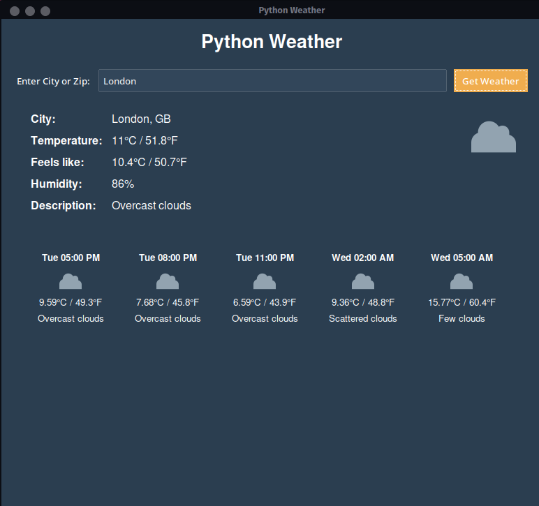

# Python Weather App

The Python Weather App is a desktop application built with Python that retrieves current weather data and a 5-day forecast using the [OpenWeatherMap API](https://openweathermap.org/). The app features a modern, sleek GUI built with Tkinter and [ttkbootstrap](https://github.com/israel-dryer/ttkbootstrap), and it supports weather lookups by both city name and postal code.

## Features

- **Weather Data Retrieval:**
    - Get current weather data and a 5-day forecast.
    - Lookup weather by city name or US postal code.
- **Modern Graphical User Interface:**
    - Sleek, dark-themed interface with rounded, colored buttons.
    - Responsive layout that displays weather details and icons.
- **Temperature Display:**
    - Displays temperatures in both Celsius and Fahrenheit.
- **Caching:**
    - Caches weather data locally to minimize unnecessary API calls.
- **Weather Icons:**
    - Displays SVG icons based on the current weather conditions.

## Installation

1. **Clone the Repository:**

   ```bash
    git clone https://github.com/Breedlove-Jason/python_weather.git
    cd python_weather
    
    python -m venv venv
    source venv/bin/activate  # On Windows: venv\Scripts\activate
   
    pip install -r requirements.txt
    pip install requests python-dotenv pillow cairosvg ttkbootstrap
    ```
    API_KEY=your_openweathermap_api_key
 
## Usage

Launch the app by running the following command in the terminal:
```bash
python gui.py
```
You can also run the application in CLI mode by executing:
```bash
python main.py
```
This mode will prompt you for a city name, display the weather data in the terminal, and cache the data locally.

## File Structure

* gui.py: Contains the GUI implementation using Tkinter and ttkbootstrap.

* main.py: CLI entry point for retrieving and displaying weather data.

* weather_api.py: Handles API requests and parsing of weather data.

* cache.py: Implements caching for weather data.

* utils.py: Contains utility functions, including SVG icon conversion for Tkinter.

## Customization

* Button Styling: The app uses ttkbootstrap's superhero theme for rounded, modern controls. The "Get Weather" button uses the orange "warning" bootstyle. Adjust the bootstyle or themename in gui.py to customize the appearance.

* API Configuration: Ensure your .env file contains a valid API key from OpenWeatherMap.

## License

This project is licensed under the MIT License.

## Acknowledgements

* OpenWeatherMap for providing weather data.
* ttkbootstrap for modern theming and styling.

## Screenshots
